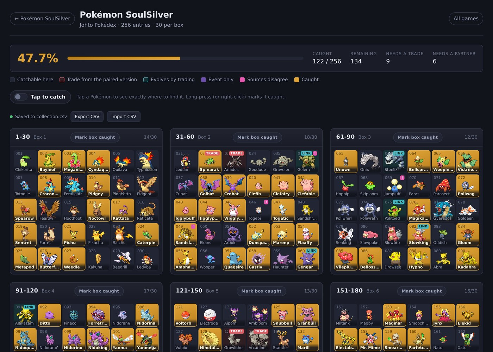
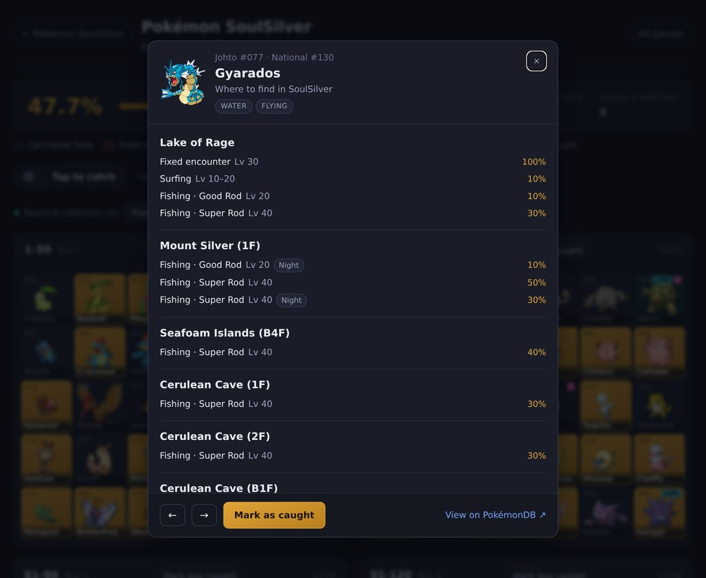
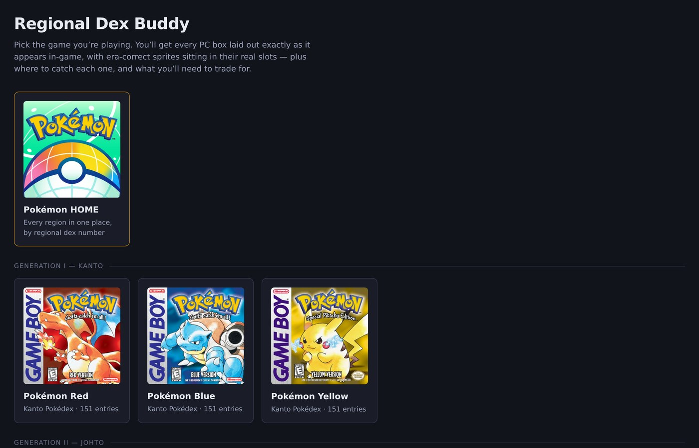
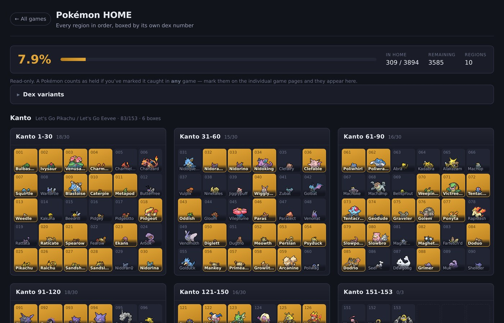
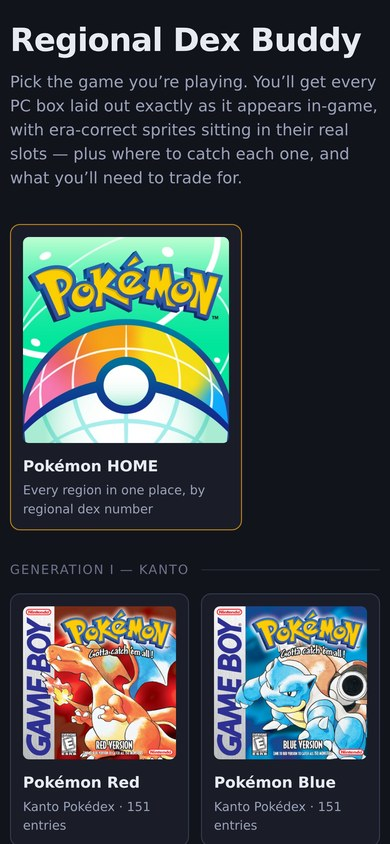

# Regional Dex Buddy

A self-contained, offline reference for filling PC boxes in regional-Pokédex order.

Pick a game and you get **every PC box laid out exactly as the game shows it** — the
real grid, era-correct sprites in their exact slots, boxes labelled the way you'd
name them in-game (`1-30`, `31-60`, …). Tap any Pokémon to see precisely where to
catch it *in that version*. Mark what you've caught and watch the percentage climb.

Covers all **38 mainline versions**, Red through Legends: Z-A — 24 regional dexes,
11,340 entries, 5,819 sprites. Plus a **Pokémon HOME** view that lays out every
region in sequence, boxed by that region's own dex number.

> Not affiliated with, endorsed by, or connected to Nintendo, Creatures Inc.,
> GAME FREAK inc. or The Pokémon Company. See [NOTICE](NOTICE.md).

## Why this exists

This was built for one specific job: **completing a full set of regional Pokédexes
on original hardware, while that is still possible.** Pokémon Bank will not be
around forever, and moving a collection across generations depends on it — so the
window for doing this the old way is finite. That deadline is the whole reason this
tool exists.

It is **not** a replacement for [PokéAPI](https://pokeapi.co/),
[PokémonDB](https://pokemondb.net/), [Serebii](https://www.serebii.net/) or
[Bulbapedia](https://bulbapedia.bulbagarden.net/). Those are vastly more thorough
and expansive than this will ever be, they are where every fact here came from, and
you should go and use them. This is deliberately narrow by comparison.

What it does instead is one thing, precisely: show you **what goes in which box, in
what order, for the game in front of you** — and keep the whole thing local. No
account, no sign-in, no network access at runtime, no service that can be shut down
from under you. Clone it and it keeps working.

---

## What it looks like

Every box as the game lays it out — era-correct sprites in their real slots, gold
for caught, tags for anything needing a trade or a link partner:



Tap any Pokémon for where to find it in that version — and, where sources
disagree, exactly what each one claims:



Pick a game from the menu, or jump straight to the HOME rollup:



**Pokémon HOME** — every region in sequence, boxed by its own dex number. A
Pokémon only fills a region's slot if you caught it in that region:



It works on a phone, two covers to a row:



---

## Quickstart

You need **Python 3.8+**. Nothing else — no build step, no `npm install`, no
database, no internet connection at runtime.

```sh
git clone https://github.com/cybolt-games/pokemon-regional-master-dex-tracker.git
cd pokemon-regional-master-dex-tracker

python3 setup.py     # downloads sprites and cover art (a few minutes, once)
python3 serve.py     # http://localhost:8000
```

Pick a different port with `python3 serve.py 9000`.

### Why the setup step?

All the *data* is in the repo — dex ordering, locations, exclusives, box
geometry. The **sprites and cover art are not**. They're Nintendo's artwork, not
this project's to redistribute, so `setup.py` downloads them from their original
sources (PokéAPI's sprite repository and PokémonDB) into `site/assets/`.

It's cached under `raw/`, so re-running costs nothing — and it's safe to
interrupt: already-downloaded files are kept and a re-run picks up where it left
off. After setup the app is fully offline; no network access at runtime.

### Docker

Fetch the assets first — the image copies them in:

```sh
python3 setup.py
docker compose up -d
```

Then open <http://localhost:8000>. Or without compose:

```sh
docker build -t regional-dex-buddy .
docker run -d -p 8000:8000 \
  -v "$(pwd)/collection.csv:/app/collection.csv" \
  --name regional-dex-buddy regional-dex-buddy
```

The volume mount is what makes your progress survive a container rebuild — see
[Your collection](#your-collection). Create the file first if it doesn't exist:

```sh
printf 'game,dex,dex_number,species,caught\n' > collection.csv
```

---

## Using it

**Pick a game** from the menu. Each game has two pages:

- **Landing page** — a link to the Bulbapedia walkthrough, a link to the box
  layouts, and the version exclusives split into *catch these here* vs *trade for
  these*.
- **Box layouts** — the actual grids.

**On the box page:**

| Action | Result |
| --- | --- |
| Tap a Pokémon | Opens its details — every location, method, level range, rarity, time of day |
| Long-press / right-click | Marks it caught |
| **Tap to catch** toggle | Swaps those two, so you can tick off a whole box with single taps |
| **Mark box caught** | Fills or clears an entire box |
| ← / → in the popup | Steps to the previous/next Pokémon (arrow keys work too) |

**Cell colours:**

| | Meaning |
| --- | --- |
| Plain | Catchable in this version |
| Red | Version exclusive — trade from the paired game |
| Teal `LINK` | Evolves only by trading, so you need a partner |
| Purple `EVENT` | Not obtainable in this game at all |
| Magenta `!` | Sources disagree — open it to see what each one claims |
| Gold | Caught |

Box pages print cleanly, if you'd rather work from paper.

---

## Your collection

Progress is a plain CSV at the repo root, written on every change:

```csv
game,dex,dex_number,species,caught
soulsilver,johto,1,chikorita,1
```

Rows identify a Pokémon by **species name**, not by any internal key, so the file
stays readable and keeps working across updates. Writes are atomic, and the previous
version is copied into `collection-backups/` first (30 kept).

`localStorage` mirrors it so the page still works if you just open the files without
a server. On load, whichever side knows about more caught Pokémon wins — an empty
file can never wipe a populated browser. **Export CSV** / **Import CSV** buttons
cover moving between machines, and import only ever adds.

Append `?demo=1` to any box page to poke around in an isolated sandbox that never
touches your real progress.

---

## Configuration

`config.json` is the whole of it. The default serves every file from this repo and
contacts nothing:

```json
{ "assets": { "profile": "local" } }
```

Other profiles are available if you want them:

| Profile | Behaviour |
| --- | --- |
| `local` | Everything from this repo. No external requests. **Default.** |
| `local-then-public` | Local first, public mirror if a file is missing |
| `cdn-first` | Your own CDN, then local, then a public mirror |
| `public-only` | Hotlink public mirrors, vendor nothing |

To override anything without editing a tracked file, copy
`config.local.example.json` to `config.local.json` — it's gitignored and merges over
`config.json` key by key.

---

## Rebuilding the data

You never need to. The built data is committed. This exists so every fact is
reproducible rather than taken on trust:

```sh
pip install -r scrapers/requirements.txt

python3 scrapers/fetch_pokeapi.py       # dex order, encounters, evolutions, locations
python3 scrapers/fetch_pokemondb.py     # dex-order cross-check, human-readable locations
python3 scrapers/fetch_serebii.py       # version exclusives, unobtainable lists
python3 scrapers/fetch_serebii_za.py    # Legends Z-A locations
python3 scrapers/fetch_sprites.py       # sprites for every registered game
python3 scrapers/fetch_boxart.py        # cover art
python3 scrapers/build_dataset.py       # merge, cross-check, validate -> site/
```

Responses cache under `raw/` (gitignored), so a re-run costs nothing. The scrapers
throttle per host, identify with a real User-Agent, and honour each site's
`robots.txt` crawl-delay.

### Adding a game

`games.json` is the registry — id, generation, region, version group, regional
dexes, box geometry, sprite set, cover art, source URLs. Adding a game is a data
change, not a code change: add the entry, run the fetchers and the build.

---

## How facts get into the data

Nothing here is written from memory. Every value is scraped, and the ones that
matter are corroborated by more than one source.

- **Dex order** — PokéAPI, cross-checked entry-by-entry against PokémonDB. A
  wholesale mismatch fails the build.
- **Locations** — PokéAPI's per-version encounter tables, carrying method, level
  range, rarity, time of day, Headbutt tree rarity, Safari Zone blocks and story
  gates. Where PokéAPI has no encounter data (BDSP, Legends: Arceus,
  Scarlet/Violet) PokémonDB's text fills in, and the page says so. Legends Z-A's
  come from Serebii.
- **Box geometry** — a decompilation constant where one exists (`pret/pokered`,
  `pokeemerald`, `pokeplatinum` and friends), otherwise an official box screenshot
  that was downloaded and counted. Nothing is inferred from "30 = 6×5". Gen 1 and 2
  are a 20-per-box **name list**, Let's Go is one 1,000-slot box, and Legends:
  Arceus uses pastures — each is rendered as what it actually is.
- **Version exclusives** — derived three ways and reconciled.

**Where sources disagree, the app shows the disagreement** rather than silently
picking a winner. A `!` marker opens to show what each source claims and, where it
can be identified, why they differ — raid dens, the Friend Safari, gift Pokémon that
one source doesn't count as a location.

---

## Project layout

```
config.json          deployment settings (asset profiles, scraping politeness)
games.json           the game registry — all 38 versions
serve.py             static server + the collection API
scrapers/            run-once data pipeline
  templates/         page shells, expanded per game at build time
site/                the app — static HTML/CSS/JS, no dependencies
  data/              built datasets, one per game, plus home.json
  assets/            sprites and cover art
```

---

## Credits and licence

The **code** is MIT licensed — see [LICENSE](LICENSE).

The **data and images are not mine to license.** They are gathered from
[PokéAPI](https://pokeapi.co/), [PokémonDB](https://pokemondb.net/) and
[Serebii](https://www.serebii.net/), and depict characters and artwork owned by
Nintendo, Creatures Inc., GAME FREAK inc. and The Pokémon Company. Box geometry was
verified against the [pret](https://github.com/pret) disassemblies. Walkthrough
links point to [Bulbapedia](https://bulbapedia.bulbagarden.net/) (CC BY-NC-SA).

Please read [NOTICE.md](NOTICE.md) before redistributing or deploying this
publicly. This is a personal, non-commercial fan tool, provided as-is.
